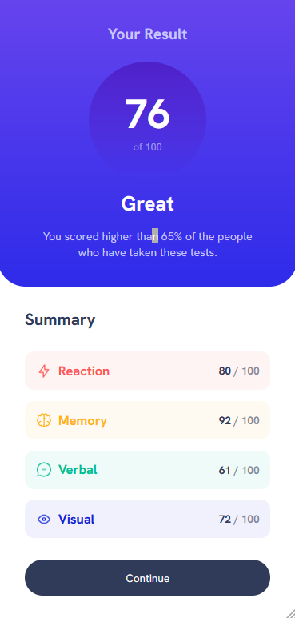

# Frontend Mentor - Results summary component solution 🚀

## Welcome 👋

This is a solution to the [Results summary component challenge on Frontend Mentor](https://www.frontendmentor.io/challenges/results-summary-component-CE_K6s0maV). Frontend Mentor challenges help you improve your coding skills by building realistic projects.

## Table of contents 📑

- [Overview 🌟](#overview-🌟)
  - [The Challenge 🧪](#the-challenge-🧪)
  - [Screenshots 📷](#screenshots-📷)
  - [Links 🔗](#links-🔗)
- [My process 🏗️](#my-process-🏗️)
  - [Built with 🛠️](#built-with-🛠️)
- [Contact 📧](#contact-📧)
- [Author 👤](#author-👤)

## Overview 🌟

### The challenge 🧪

Users should be able to:

- ✅ View the optimal layout for the interface depending on their device's screen size
- ✅ See hover and focus states for all interactive elements on the page

### Screenshots 📷

_My solution (Desktop):_

_My solution (Mobile)_

### Links 🔗

- Solution repo on github [here](https://github.com/BeanyTheCoder/results-summary-component-main)
- Solution link on Front End Mentor: [here](https://www.frontendmentor.io/solutions/results-summary-component-html-css-js-sjhuWHxZ_5)

## My process 🏗️

### Built with 🛠️

- HTML5
- CSS
  - Flexbox
  - CSS custom properties(variables)

## Contact 📧

- Frontend Mentor - [@BeanyTheCoder](https://www.frontendmentor.io/profile/BeanyTheCoder)
- Github - [BeanyTheCoder](https://github.com/BeanyTheCoder)

## Author 👤

My name is Alexander Afoko Jnr. and I am a passionate 13-year-old frontend developer from Ghana.
I hope to build up my portfolio and take my skills to the next level.
